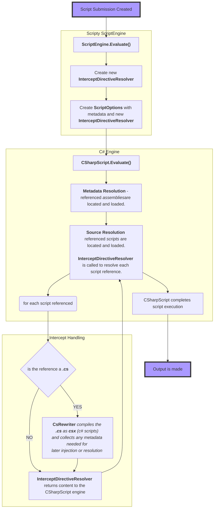

## Intercept Directive Resolver
By default, the `SourceFileResolver` (derived from `SourceReferenceResolver`)  is called by `CSharpScript` when Creating, Running, or Evaluating scripts. 
Its job is to locate the targets in the `#r` and `#load` directives and provide those source files. 

An alternate implementaion of `SourceReferenceResolver` can be provided as part of the `ScriptOptions`. 

The `InterceptDirectiveResolver` is an alternate implementation that allows the script author to include a `.cs` class file as a `#load` directive.
For most uses, the script would look something like this...

``` c#
#r ".\..\..\..\packages\NUnit.3.6.1\lib\net45\nunit.framework.dll"
#load "..\TestCs\ReferencedClass.cs"
#load "ReferencedScript.csx"

//Write using supplied ScriptContext
Output.WriteLine("namespace TestNamespace{class TestClass{public void TestMethod(){}}}");

//Create instance from recompiled assembly
var rc1 = new ReferencedClass(Context);
Output.WriteLine($"// Emitting prop with backing field {rc1.PropertyWithBackingField}");
rc1.Owl($"// using the referenced class to output")

```


Mermaid is broken for my markdown editor (node text missing), if this shows up incorrectly for you, scroll to the image below



